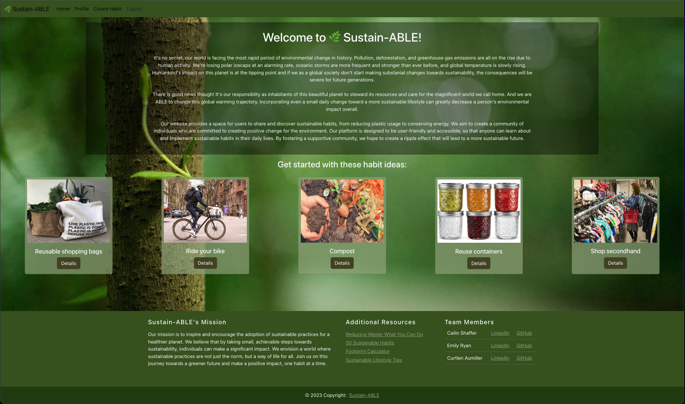
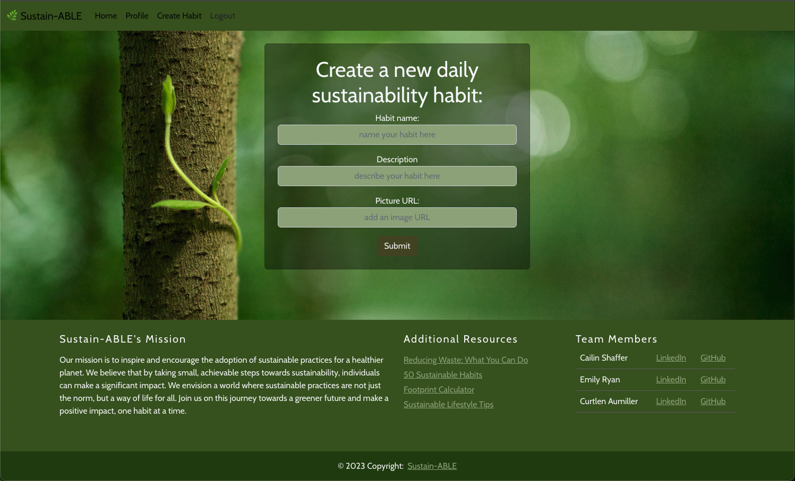
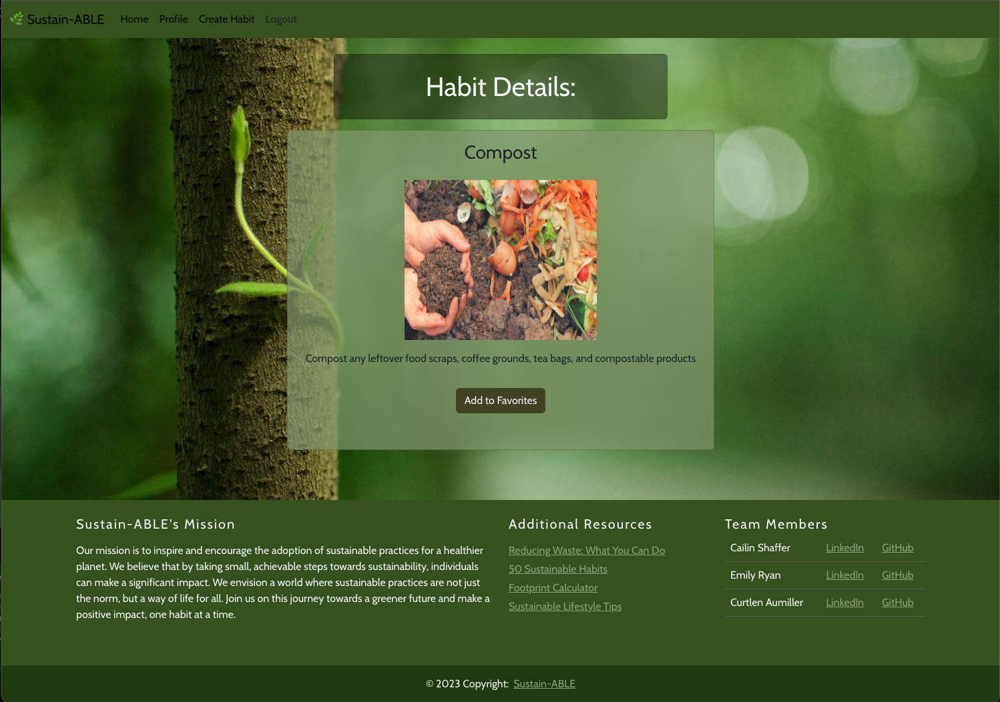
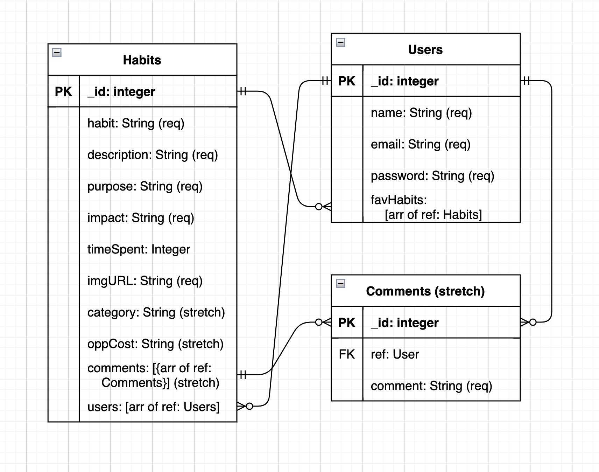
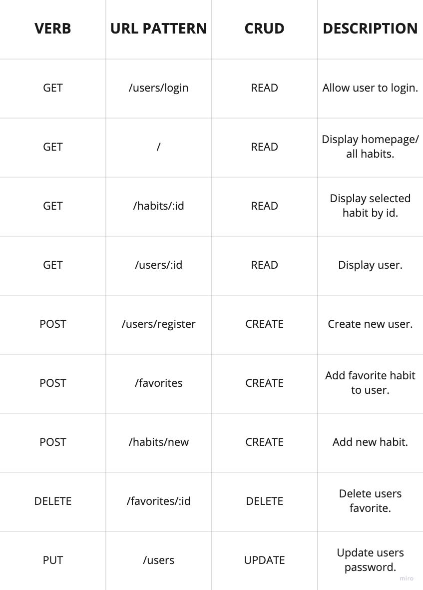
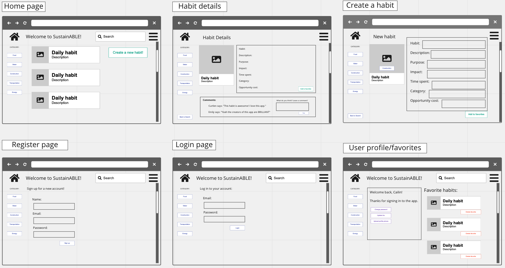

# SustainABLE 

https://main--vermillion-melba-389997.netlify.app/

It's no secret, our world is facing the most rapid period of environmental change in history. Pollution, deforestation, and greenhouse gas emissions are all on the rise due to human activity. We're losing polar icecaps at an alarming rate, oceanic storms are more frequent and stronger than ever before, and global temperature is slowly rising. Humankind's impact on this planet is at the tipping point and if we as a global society don't start making substanial changes towards sustainability, the consequences will be severe for future generations.

There is good news though! It's our responsiblity as inhabitants of this beautiful planet to steward its resources and care for the magnificent world we call home. And we are ABLE to change this global warming trajectory. Incorporating even a small daily change toward a more sustainable lifestyle can greatly decrease a person's environmental impact overall. 

# About the App

That's where sustainABLE comes in. The sustainABLE app provides an online community to like-minded individuals who want to do their part in changing the world one small step at a time. Users can register for an account and add the sustainABLE habits that they use everyday. When a user finds a habit they like and want to incorporate into their daily lives, they can favorite it to reference in the future.

# App Interface:

# Tech stack used:
* React.js
* MongoDB
* Bootstrap
* Axios
* JWT-Decode

# General Approach

As a team we started planning this app by using Miro to gather all team members ideas. After settling on the idea of a website where users can share the sustainable habits they use in their daily lives, we then moved on to planning the structure of the app. We started out creating our ERDs and User Stories which then guided us on how the Restful Routing chart would work. With the basic structure of the app performance completed, we then used Miro to create a page structure outline to divide the work between team members to ensure we did not create merge conflicts.

We then as a group started testing how to correctly use the GitHub workflow to ensure we all were correctly pushing and pulling the needed files. Once comfortable with the GitHub workflow, we started building the backend structure using a test file to ensure the routes would perform as expected on the server side. After ensuring we had the backend routes correct, we created controllers for each of the URL paths we needed and moved the routes we tested to the proper controllers. We then moved on to creating the needed files and making basic boilerplates to make sure the URL paths worked as we expected.

With a useable server and basic client side rendering to the browser, we pseudo-coded the client side to reference what we wanted to accomplish on each view. We then divided the work to focus on individual pages referencing the page structure outline we had created on Miro. Focusing on getting the information needed on each page, we proceeded to render the database information. Once each page was showing the information we wanted, we began working on styling the app. After some time working unsuccessfully to use Bulma as a CSS framework we decided to switch to Bootstrap as we were more familiar with it. We added a navbar, footer, and began to add cards to hold the information shown in each screen. With the format of our CSS complete, we then created a uniform color scheme for the app. With the app looking good we then worked to correct some of the small styling errors. Lastly, we cleaned up and formatted the code for better readability.

# Installation Instructions

* Fork and Clone the repo to your local repository
* Run `npm init -y` to initialize npm in the terminal
* Open the package.json file and confirm the npm packages listed under 'dependencies'
* In the terminal run `npm install` or `npm i` to download all required npm packages.
* Make sure node_modules and .env.local folder are showing the gitignore files before committing to repository
* Use the `npm start` command in the terminal to start the React app in your web browser
* Use the `nodemon` command in the terminal to start your application server locally

# ERDs

# Restful Routing Chart

# Wireframes of all user views

# User Stories

* As a user, I want to be able to create a new profile with an email and password
* As a user, I want to be able to sign in to my account
* As a user, I want to be able to create a new habit using a form to fill out and submit
* As a user, I want to be able to add favorite habits to be saved to my profile
* As a user, I want to be able to delete a favorite habit from my profile
* As a user, I want to be able to update my password

# MVP goals

* Users can create account with email and password
* Users can sign into their accounts
* Users can create new habits, filling out a form
* Users can favorite habits

# Stretch Goals

* Users can add comments to habits
* Users can update their password
* Users can delete a favorite habit
* Add a category dropdown to the new habit form
* Adding up overall impact of favorited habits
* More stats to the intro!!

# Unsolved problems or major hurdles we overcame

* Getting comfortable with Git Workflow
* Not allowing favorites to be added to a user's favorites array multiple times
* Having the Navbar conditionally render based on whether or not the user was signed in
* Getting the footer to stick to the bottom of the screen without covering the cards

